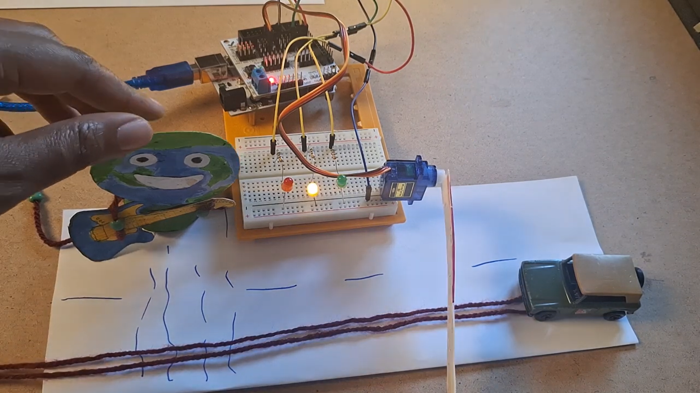
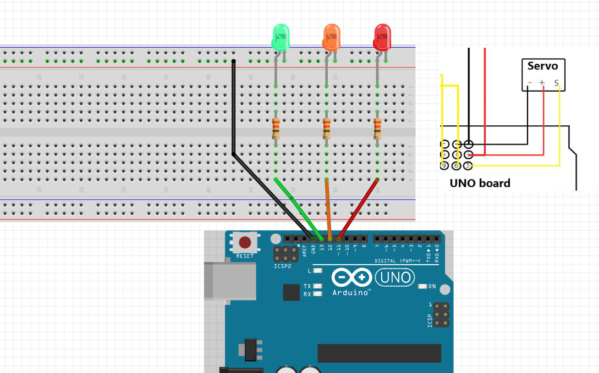
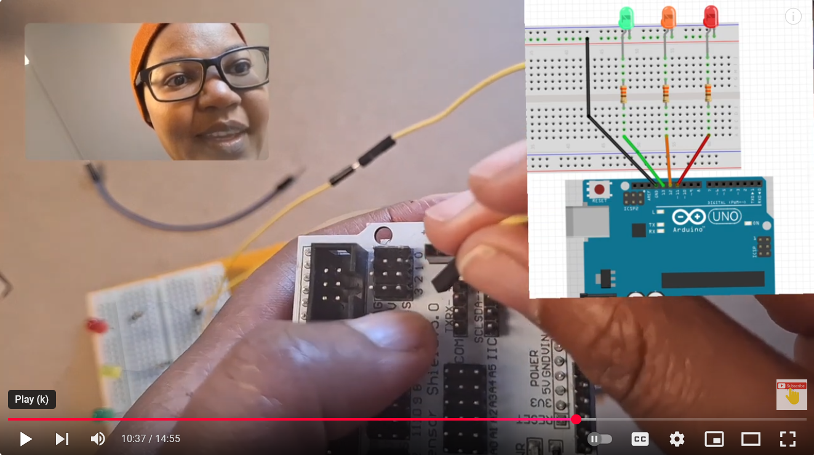

# Smart-Traffic-Light-System-Project3
There is no need of carrying heavy bricks as a warning to drivers when crossing the road. With Our Smart Traffic Light System, You can Cross the road like the Rockstar You are and with ease and in safety. 

## Step 1: Gather all the Necessary Components
* Arduino Uno
* Sensor shield
* Power cable
* Computer
* Resistors(3 pieces- preferably 220 ohms)
* Jumper wires
* Servo motor sg90
* Breadboard
* LED (3 pieces)
* Paper
* Pedestrian
* Car

### Software
* Arduino IDE (download IDE from www.arduino.cc/en/software) 
* DuckDuckGo (www.duck.ai)

## Step 2: Connect the Components (use wiring diagrams)

## Step 3: Write Your Code using Duck.ai
**Click to View or Copy code: ** :point_right: https://github.com/njeriolenkere/Smart-Traffic-Light-System-Project3/blob/main/project3.ino

## Step 4: Upload and Run 
video
Watch step by step tutorial here :point_down: 

